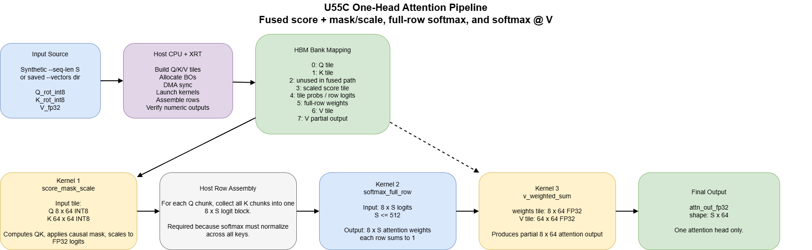
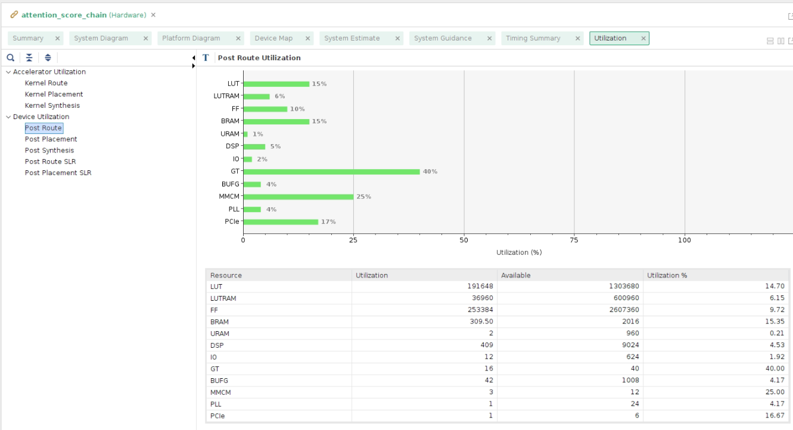
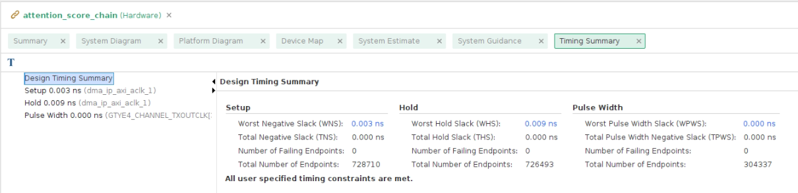

# Attention Score Acceleration on U55C

This repo implements and verifies an isolated one-head transformer attention
pipeline on an AMD/Xilinx Alveo U55C FPGA.

```text
Q_rot_int8, K_rot_int8, V_fp32
-> QK^T score
-> causal mask + scale
-> full-row softmax
-> softmax @ V
-> attn_out_fp32 for one head
```

The design is verified with synthetic vectors and TinyLlama-derived saved
vectors. It is **not** a full TinyLlama runtime, decoder integration, or
model-level tokens/sec benchmark.

## Current Status

- Required implementation tracks are complete for the frozen one-head design.
- Fused score/mask/scale path builds and runs on the real U55C.
- Synthetic sequence lengths `S = 8, 64, 128, 256, 512` pass FPGA verification.
- TinyLlama-derived vector directories `S = 16, 64, 128, 256, 512` pass FPGA
  verification.
- The FPGA path is functionally correct, but still slower than the CPU/GPU
  baselines for this small isolated workload.

Expected FPGA pass signal:

```text
Tiled sequence verification PASSED
Attention output verification PASSED
XRT chain verification PASSED
```

## Architecture



The frozen design keeps orchestration in the XRT host and uses HBM-backed
buffers between kernels. The fused pre-softmax kernel removes the old raw-score
HBM round trip by computing score, mask, and scale in one stage.

HBM mapping for the fused path:

| Data | HBM bank |
|---|---:|
| Q tile | HBM[0] |
| K tile | HBM[1] |
| fused scaled logits | HBM[3] |
| tile probabilities / full-row logits | HBM[4] |
| full-row probabilities / V weights | HBM[5] |
| V chunk | HBM[6] |
| V partial output | HBM[7] |

`HBM[2]` was used by the older staged raw-score path and is not part of the
main fused pre-softmax path.

## Repo Layout

| Path | Purpose |
|---|---|
| `hls/` | HLS kernels and C++ testbenches |
| `host/` | XRT host app, build scripts, demo helpers |
| `model/` | Python reference, TinyLlama extraction/export, CPU/GPU baselines |
| `sim/` | Synthetic and TinyLlama-derived verification vectors |
| `docs/` | Checklists, concepts, results, runbook, report source |
| `docs/report_assets/` | Report/presentation images and editable architecture diagram |
| `docs/artifacts/u55c_fused/` | Final routed U55C reports, Vitis summaries, guidance HTML |
| `docs/presentations/` | Final presentation files |

## Quick Run

On the Linux machine attached to the U55C:

```bash
cd /path/to/attention-score-acceleration
source host/setup_2022_2_env.sh
unset XCL_EMULATION_MODE
```

Run one synthetic sequence length:

```bash
./build/host_attention_score_chain \
  --xclbin build/attention_score_chain.xclbin \
  --seq-len 512 \
  --device 0
```

Run real TinyLlama-derived vectors:

```bash
for d in \
  sim/real_tinyllama_s16 \
  sim/real_tinyllama_s64 \
  sim/real_tinyllama_s128 \
  sim/real_tinyllama_s256 \
  sim/real_tinyllama_s512
do
  ./build/host_attention_score_chain \
    --xclbin build/attention_score_chain.xclbin \
    --vectors "$d" \
    --device 0
done
```

The demo helper wraps the common commands:

```bash
source host/demo_env.sh
demo_help
demo_card
demo_sweep
demo_real_vectors
```

## Build Commands

Build the XRT host:

```bash
bash host/build_host.sh
```

Build hardware emulation:

```bash
bash host/build_xclbin.sh \
  hw_emu \
  /opt/xilinx/platforms/xilinx_u55c_gen3x16_xdma_3_202210_1/xilinx_u55c_gen3x16_xdma_3_202210_1.xpfm
```

Build real hardware:

```bash
bash host/build_xclbin.sh \
  hw \
  /opt/xilinx/platforms/xilinx_u55c_gen3x16_xdma_3_202210_1/xilinx_u55c_gen3x16_xdma_3_202210_1.xpfm
```

Full hardware linking is slow, so demos should use the already-built `.xclbin`
when available.

## Local Verification

Run local C++ checks:

```bash
bash host/run_local_csim.sh
```

Run the Python full-sequence tiling check:

```bash
python model/attention_score_ref.py --check-full-tiling
```

Check TinyLlama setup:

```bash
python model/check_tinyllama_setup.py
```

Export real TinyLlama vectors:

```bash
python model/export_real_vectors.py --seq-len 128 --output-dir sim/real_tinyllama_s128
```

## Results Summary

Synthetic fused FPGA runs:

| S | tiles | CPU ms | GPU ms | fused FPGA ms | FPGA speedup vs CPU |
|---:|---:|---:|---:|---:|---:|
| 8 | 1 | 0.0322 | 0.3349 | 0.296 | 0.11x |
| 64 | 8 | 0.2920 | 0.2507 | 2.364 | 0.12x |
| 128 | 32 | 2.5009 | 0.2998 | 5.484 | 0.46x |
| 256 | 128 | 3.9523 | 0.2726 | 17.307 | 0.23x |
| 512 | 512 | 12.3290 | 0.2461 | 60.328 | 0.20x |

Real TinyLlama-derived fused FPGA runs:

| vector dir | S | fused FPGA ms |
|---|---:|---:|
| `sim/real_tinyllama_s16` | 16 | 0.569 |
| `sim/real_tinyllama_s64` | 64 | 2.004 |
| `sim/real_tinyllama_s128` | 128 | 6.816 |
| `sim/real_tinyllama_s256` | 256 | 17.192 |
| `sim/real_tinyllama_s512` | 512 | 55.329 |

Full details are in `docs/track_d_results.md`.

## Routed Utilization And Timing



Final routed report highlights for the fused xclbin:

| Scope | LUT | REG | BRAM | URAM | DSP |
|---|---:|---:|---:|---:|---:|
| User kernels | 60,983 | 70,401 | 110 | 2 | 405 |
| Full routed design | 191,648 CLB LUTs | 253,388 CLB registers | 309.5 Block RAM tiles | 2 | 409 |

The final timing report meets routed timing with `WNS 0.003 ns`, `TNS 0`, and
`WHS 0.009 ns`.



Primary artifacts:

- `docs/artifacts/u55c_fused/reports/PostRouteKernelUtilization.rpt`
- `docs/artifacts/u55c_fused/reports/PostRouteFullUtilization.rpt`
- `docs/artifacts/u55c_fused/reports/PostRouteSLRUtilization.rpt`
- `docs/artifacts/u55c_fused/reports/PostRouteTimingSummary.rpt`
- `docs/artifacts/u55c_fused/reports/PostRouteUtilization.xlsx`
- `docs/artifacts/u55c_fused/vitis/attention_score_chain_xclbin_info.txt`
- `docs/artifacts/u55c_fused/vitis/attention_score_chain_xclbin_link_summary.txt`
- `docs/artifacts/u55c_fused/vitis/DeviceMap.png`
- `docs/artifacts/u55c_fused/vitis/SystemDiagram.pdf`
- `docs/artifacts/u55c_fused/vitis/PlatformDiagram.pdf`
- `docs/artifacts/u55c_fused/guidance/`

The detailed Vitis device map and platform/system diagrams are kept as linked
evidence rather than embedded in the README body, because they are tool reports
for inspection rather than the high-level design explanation.

## Key Limitations

- Q/K/V projection and RoPE are prepared before this FPGA boundary.
- The host still launches many tile-level kernel operations.
- Intermediate tensors still pass through HBM-visible buffers.
- Only one attention head is computed.
- The current design is a verified accelerator block, not an end-to-end LLM.

## Next Optimization Direction

The next work is captured in `docs/implementation_checklist_optimization.md`.
The main performance targets are fewer host launches, deeper on-card dataflow,
better reuse of HBM-resident tiles, and a narrower deployable multi-K
`softmax @ V` datapath.
